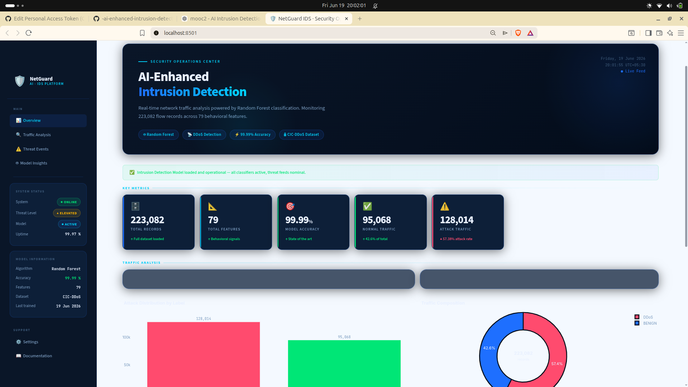
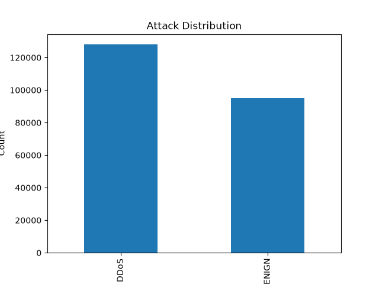
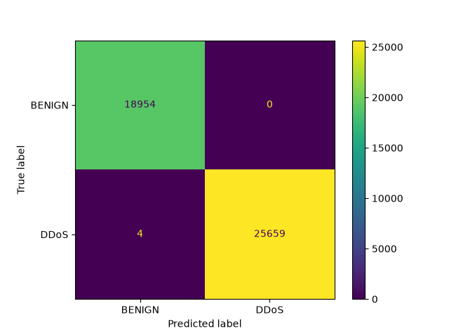
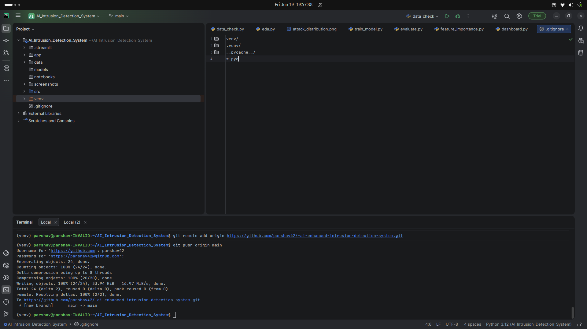

# 🛡️ AI-Enhanced Intrusion Detection System

An AI-powered Intrusion Detection System (IDS) that detects DDoS attacks in network traffic using Machine Learning and provides an interactive dashboard for cybersecurity monitoring.

## 📌 Project Overview

Traditional rule-based intrusion detection systems struggle to identify evolving cyber threats and often generate high false-positive rates. This project leverages Machine Learning to classify network traffic as either normal or malicious.

The system uses the CICIDS2017 dataset and a Random Forest classifier to detect DDoS attacks with high accuracy.

## 🎯 Objectives

* Detect malicious network traffic using Machine Learning
* Classify network traffic as BENIGN or DDoS
* Visualize network security metrics through an interactive dashboard
* Improve intrusion detection accuracy

## 🗂️ Dataset

Dataset: CICIDS2017

Classes:

* BENIGN
* DDoS

## 🛠️ Technology Stack

* Python
* Pandas
* NumPy
* Scikit-learn
* Matplotlib
* Streamlit
* Joblib
* Git & GitHub

## ⚙️ Project Workflow

```text
Data Collection
      ↓
Data Preprocessing
      ↓
Exploratory Data Analysis
      ↓
Model Training
      ↓
Model Evaluation
      ↓
Dashboard Development
```

## 🤖 Machine Learning Model

* Algorithm: Random Forest Classifier
* Training Samples: 178,465
* Testing Samples: 44,617

## 📊 Model Performance

| Metric    | Value  |
| --------- | ------ |
| Accuracy  | 99.99% |
| Precision | 1.00   |
| Recall    | 1.00   |
| F1-Score  | 1.00   |

## 🔍 Top Features

* Fwd Packet Length Max
* Fwd Packet Length Mean
* Init_Win_bytes_forward
* Bwd Packet Length Min
* Avg Fwd Segment Size

## 📁 Project Structure

```text
AI_Intrusion_Detection_System/

├── app/
│   └── dashboard.py
├── models/
│   └── random_forest_model.pkl
├── screenshots/
├── src/
│   ├── data_check.py
│   ├── data_cleaning.py
│   ├── eda.py
│   ├── train_model.py
│   ├── evaluate.py
│   └── feature_importance.py
├── .gitignore
├── README.md
└── requirements.txt
```

## 🚀 Installation

Clone the repository:

```bash
git clone <repository-url>
cd AI_Intrusion_Detection_System
```

Create a virtual environment:

```bash
python3 -m venv venv
source venv/bin/activate
```

Install dependencies:

```bash
pip install -r requirements.txt
```

## ▶️ Run the Dashboard

```bash
streamlit run app/dashboard.py
```

Open:

```text
http://localhost:8501
```

## 📸 Screenshots

### Dashboard



### Attack Distribution



### Confusion Matrix



### Project structure




## 👨‍💻 Developer

**Parshav Khoche**

Final Year B.Tech – Computer Science & Engineering

SmartInternz Project
